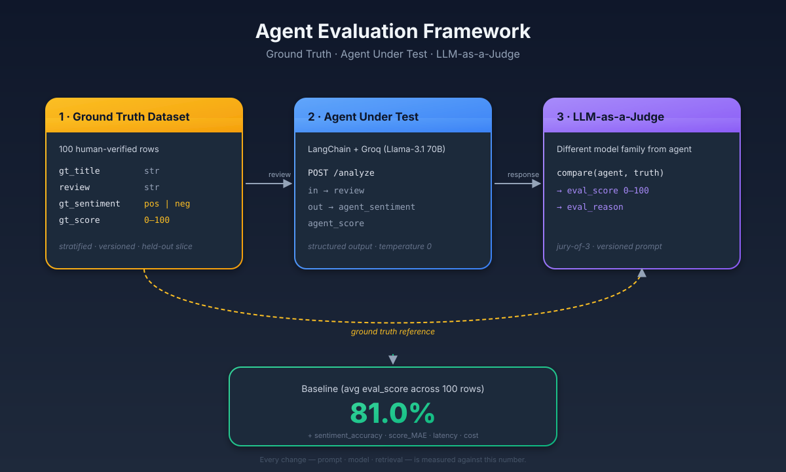

# GenAI Agents Evaluation Framework

> A general-purpose framework for measuring whether any LLM-powered agent is getting better — and proving it with numbers, not vibes.



---

## Why "It Works on My Prompt" Isn't Enough

GenAI outputs are **probabilistic and open-ended** — traditional software has `expected == actual`, but LLM outputs rarely match character-for-character yet can still be semantically correct (or subtly wrong). A prompt that wows in a demo can silently break after a model upgrade, and nobody notices until a customer complains. Before you touch a model version, a system prompt, or a retrieval config, you need a repeatable way to ask: *did this change make my agent better, worse, or about the same?*

The framework in this post is **agent-agnostic**. It applies equally to a RAG assistant, a summarizer, a classifier, a code-generation agent, or a multi-step tool-using agent. To make it concrete, I'll thread a running example — a sentiment-scoring agent over movie reviews — but treat that as a *vehicle for the framework*, not the subject. The three steps, schema shapes, and metrics stay the same whatever your agent does.

---

## The Three-Step Framework

Whatever your agent does, evaluation reduces to three steps:

1. **Build a Ground Truth Dataset** — a small, human-verified set of inputs paired with ideal outputs, in whatever shape your agent produces.
2. **Build (or wrap) the Agent** — the system under test, exposed via a stable endpoint so evaluation hits the same surface production does.
3. **Evaluate with LLM-as-a-Judge** — score each agent response against the ground truth and track a single baseline number you can defend, alongside deterministic metrics.

Every agent has inputs and outputs. The framework doesn't care what they *mean*; it cares that you can 
- (a) fix a set of reference inputs, 
- (b) hand the same inputs to the agent, and 
- (c) compare the two outputs in a way that produces a number. Everything below is a pattern for doing that well.

---

## Step 1 — Build the Ground Truth Dataset

A ground truth row has three parts: the **input** to the agent, the **expected output** a human would accept as correct, and optional **metadata** (difficulty, category, source) for slicing results later.

```python
{
    "input":    <whatever your agent consumes>,
    "expected": <ideal output in the agent's output shape>,
    "meta":     {...},
}
```

For our running example, the agent is a **movie-review sentiment analyzer**. It receives a movie review as plain text and produces two outputs: a **sentiment label** (`positive` or `negative`) and a **positivity score** (an integer from 0 to 100, where 0 means the review is entirely negative and 100 means it is overwhelmingly positive). Think of the sentiment as the classification and the score as the confidence/intensity.

Because the agent produces structured output, our ground truth dataset must mirror that shape exactly — same fields, same value ranges — so we can compare them side by side during evaluation.

### Example schema (sentiment agent)

```python
{
    "gt_title":      str,         # movie title (metadata for identification)
    "review":        str,         # the review text — this is the input to the agent
    "gt_sentiment":  "positive" | "negative",  # human-verified sentiment label
    "gt_score":      int,         # 0–100 positivity score, human-assigned
}
```

Here `gt_` (ground truth) prefixed fields are the human-verified ideal outputs. During evaluation, these will be compared against the agent's predictions (`agent_sentiment`, `agent_score`) to measure accuracy.

### Source

The general rule: **start from real data, then have a human verify it.** Scraping alone gives you a dataset; human verification gives you *ground truth*.

For our sentiment example, we curated 100 Bollywood movie reviews manually — 50 positive, 50 negative — spanning classics (Sholay, Andaz Apna Apna) to recent releases (Kill, 12th Fail). Each row was human-verified: the sentiment label was confirmed and the 0–100 positivity score was assigned by reading the review, not inferred from a star rating.

```
gt_title,review,gt_sentiment,gt_score
Lagaan,"A masterpiece that blends cricket, patriotism, and drama...",positive,95
Race 3,"Absolute disaster. The dialogue is laughably bad...",negative,8
```

The full dataset is in [`ground_truth_dataset.csv`](evaluation/ground_truth_dataset.csv) — 100 rows, balanced sentiment, score range 4–98.

Where your ground truth comes from depends on the agent:

| Agent type | Typical source |
|---|---|
| **Classification / sentiment** | Public datasets (IMDB, SST) + human scoring pass |
| **RAG** | Real user questions + expert-written reference answers |
| **Summarization** | Documents + human-written summaries |
| **Code generation** | Task specs + verified reference implementations |
| **Tool-using agent** | Real task logs + human-validated trajectories |

Whatever the source, the human-in-the-loop pass is what separates a ground truth dataset from raw data.

---

## Step 2 — Build (or Wrap) the Agent

The agent is whatever your team already ships or is planning to ship. The only constraints the framework imposes:

- **Deterministic interface.** Same input → same output shape, every time.
- **Served like production.** Wrap it in the same endpoint  you'll deploy — evaluation should exercise the serving layer, not bypass it.
- **Structured output.** If your agent returns free text, add a parsing layer so the judge and the deterministic metrics have something to compare.

For the running example: review in, sentiment + score out, via **LangChain** with **Groq** (Llama 3.1 70B through the OpenAI-compatible SDK) — chosen for fast, cheap iteration. Swap in any provider; the framework doesn't care.

The full agent implementation — including the LangChain setup, system prompt with scoring guidelines, session management, and the FastAPI server — is documented in [`agent/agent-README.md`](agent/agent-README.md).

### The consistency problem: batching + thread_id

If you send 100 reviews as 100 independent API calls, the LLM treats each one in isolation. Review #1 and review #47 might use different internal calibration — a "pretty good" review could score 72 in one call and 65 in another. The outputs drift even at `temperature=0` because each call lacks relative context.

Two mechanisms fix this:

**Batching** — instead of one review per request, send 10 at a time. Within a single batch, the LLM sees all 10 reviews together and scores them relative to each other. A glowing review next to a lukewarm one forces clearer separation.

**Thread ID (conversation history)** — across batches, pass a `thread_id` that carries conversation history. When batch 2 arrives, the LLM sees batch 1's reviews *and its own scores* in the chat history. This gives it calibration context: "I scored a similar review 78 last batch, so this one should land around 75."

```python
thread_id = str(uuid.uuid4())        # one ID for the entire eval run
for i in range(0, 100, BATCH_SIZE):   # 10 batches of 10
    batch = ground_truth[i : i + BATCH_SIZE]
    results = requests.post(ENDPOINT, json={
        "reviews": batch,
        "thread_id": thread_id,       # same ID → LLM sees all prior batches
    })
```

The LLM now applies a consistent scoring rubric across all 100 reviews because every batch is informed by the decisions that came before it.

For a deep dive into how `thread_id` works — including the session history implementation, what changes with vs. without it, and practical notes on batch sizing — see [`agent/agent-README.md` → Why thread_id matters](agent/agent-README.md#why-thread_id-matters).

---

## Step 3 — Evaluate with LLM-as-a-Judge

For each ground-truth row, call the agent endpoint and ask a **judge LLM** to score how close the agent's response is to the ideal. The judge is a separate LLM whose only job is to compare two outputs and produce a structured verdict. This pattern works for any agent — summaries, answers, plans, explanations, diffs.

### How it works

The evaluation script ([`evaluation/evaluate.py`](evaluation/evaluate.py)) runs in three phases:

**Phase 1 — Collect agent responses.** The script reads the ground truth CSV and sends reviews to the agent endpoint in batches of 10 with a shared `thread_id`. After this phase, every row has both the ground truth and the agent's prediction side by side:

| # | Review | gt_sentiment | gt_score | agent_sentiment | agent_score |
|---|---|---|---|---|---|
| 1 | "A masterpiece that blends cricket, patriotism..." | positive | 95 | positive | 88 |
| 2 | "Absolute disaster. The dialogue is laughably bad..." | negative | 8 | negative | 12 |
| 3 | "Misunderstood on release, this is Imtiaz Ali's most personal..." | positive | 86 | positive | 74 |
| 4 | "Ajay Devgn is superb as a father protecting his family..." | positive | 90 | positive | 91 |
| 5 | "The most disliked trailer on YouTube for a reason..." | negative | 6 | positive | 30 |

**Phase 2 — Judge each row.** A judge LLM (a *different* model from the agent to avoid self-preference bias) evaluates every row independently. It receives the review, the ground truth, and the agent's response, then returns:

| Field | Type | Description |
|---|---|---|
| `review` | string | The original review text, passed through for traceability |
| `eval_score` | int (0–100) | How close the agent got to the ideal |
| `eval_reason` | string | One-line justification citing the numeric gap and sentiment match |

The judge follows explicit scoring rules: sentiment mismatch caps `eval_score` at 40 (getting the direction wrong is the most expensive mistake), and score proximity determines the rest (±5 = near-perfect, ±15 = good, ±30+ = weak).

| # | Review | gt | agent | Sentiment match? | Score gap | eval_score | eval_reason |
|---|---|---|---|---|---|---|---|
| 1 | "A masterpiece that blends cricket..." | positive, 95 | positive, 88 | Yes | 7 | 85 | Sentiment matched. Score gap of 7 — within good range. |
| 2 | "Absolute disaster..." | negative, 8 | negative, 12 | Yes | 4 | 92 | Sentiment matched. Score gap of 4 — near-perfect. |
| 3 | "Misunderstood on release..." | positive, 86 | positive, 74 | Yes | 12 | 72 | Sentiment matched. Score gap of 12 — acceptable but notable drift. |
| 4 | "Ajay Devgn is superb..." | positive, 90 | positive, 91 | Yes | 1 | 97 | Sentiment matched. Score gap of 1 — near-perfect alignment. |
| 5 | "The most disliked trailer..." | negative, 6 | positive, 30 | **No** | 24 | **12** | Sentiment mismatch (capped at 40). Score gap of 24. Combined: 12. |

**Phase 3 — Compute the baseline.** The average of all 100 `eval_score` values becomes the baseline — the single number every future change is measured against. Two deterministic metrics are computed alongside it:

```
baseline_score       = avg(eval_score across all 100 rows)
sentiment_accuracy   = % of rows where agent_sentiment == gt_sentiment
score_mae            = avg(|gt_score - agent_score|) across all rows
```

For the full evaluation walkthrough — including the judge prompt, scoring rules breakdown, why we take the average, and how the three metrics complement each other — see [`evaluation/eval-README.md`](evaluation/eval-README.md).

---

## Applying the Framework to Other Agents

The sentiment example was a vehicle. The pattern carries across agent types with almost no change:

| Agent | Ground-truth row | Deterministic metric | Judge rubric |
|---|---|---|---|
| **RAG assistant** | question → reference answer + citations | citation precision/recall | factual grounding, completeness |
| **Summarizer** | document → human summary + key points | ROUGE / BERTScore | coverage, conciseness, faithfulness |
| **Classifier** | input → label | accuracy, F1 | reasoning quality on errors |
| **Code agent** | task → reference diff + tests | tests pass, lint, type-check | readability, scope discipline |
| **Tool-using agent** | task → expected tool trajectory + final output | trajectory match | result quality, efficiency |
| **Chat / assistant** | user turn → reference response | — | helpfulness, safety, tone |

> The three steps — ground truth, agent-under-test, judge — don't change. Only the shape of the rows and the rubric do.

---

## Project Structure

```
blog/
├── agent-evaluation-framework.md   ← this post
├── ground_truth_dataset.csv        ← 100 human-verified Bollywood reviews
├── requirements.txt
├── .env.example
├── agent/
│   ├── agent-README.md             ← agent deep dive: thread_id, batching, API
│   ├── agent.py                    ← core agent: LangChain + Groq, session history
│   └── server.py                   ← FastAPI endpoint
└── evaluation/
    ├── eval-README.md              ← evaluation deep dive: judge, scoring, baseline
    ├── evaluate.py                 ← evaluation script: batch → judge → metrics
    └── results/                    ← JSON output per run
```

- **[`agent/agent-README.md`](agent/agent-README.md)** — how the agent works, why `thread_id` matters for consistent LLM responses, the session history implementation, and the API reference.
- **[`evaluation/eval-README.md`](evaluation/eval-README.md)** — how the LLM-as-a-Judge evaluation works end to end: the three phases, scoring rules, how the baseline is computed from the average of `eval_score`, and how the three metrics complement each other.

